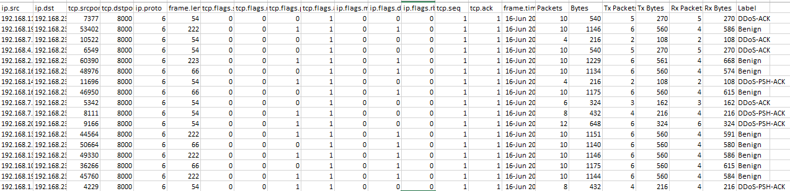
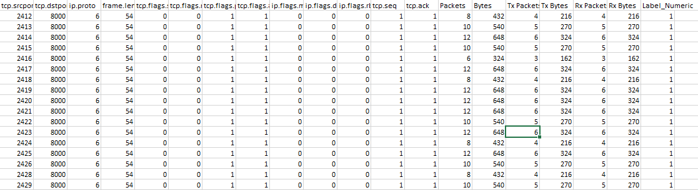
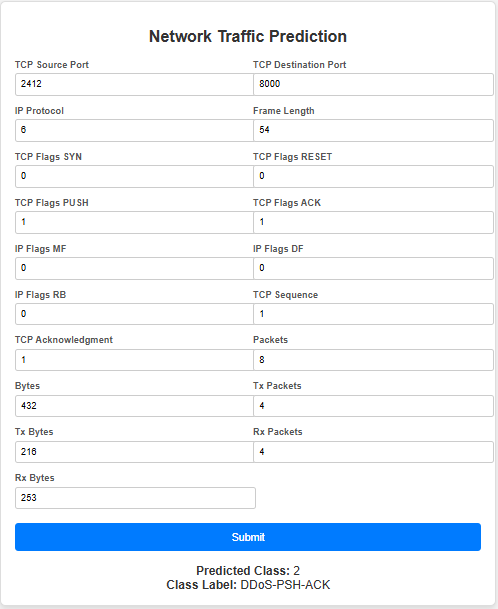

# Network Traffic Prediction 📶📊
[](https://github.com/prsdm/network-traffic-prediction) [](https://medium.com/@yourusername/network-traffic-prediction-for-beginners) [](https://x.com/okeyamy)

Welcome to the **Network Traffic Prediction** project! This project aims to classify network traffic to aid in traffic management and security analysis, using a machine learning model deployed with FastAPI.

## Data Cleaning and Preprocessing
In the process of preparing the dataset, several columns were removed or retained based on their relevance to model performance and privacy concerns:

- **Dropped Columns**:
  - **`ip.src`** and **`ip.dst`** were removed due to privacy concerns, as they contain sensitive IP information that could identify specific devices.
  - **`frame.time`** was also removed because feature importance analysis indicated it contributed minimally to prediction accuracy.

- **Retained Columns with Fixed Values**:
  - Columns such as **`tcp.dstport`**, **`ip.proto`**, **`tcp.flags.syn`**, **`tcp.flags.reset`**, **`ip.flags.mf`**, and **`ip.flags.rb`** have fixed or constant values across the dataset. Despite their lack of variability, they were retained as they do not impact data security and might provide contextual consistency for certain traffic patterns.

This data-cleaning approach balances the need for privacy with maintaining feature diversity for model training.

## Dataset Column Details
The following table provides an in-depth explanation of each column in the dataset. Understanding each feature helps in analyzing network traffic patterns and building an effective classification model.

| Column Name       | Description                                                                                          | Meaning |
|-------------------|------------------------------------------------------------------------------------------------------|---------|
| **tcp.srcport**   | Source TCP Port                                                                                      | The port number on the sender's device. Ports identify specific processes or services on devices. |
| **tcp.dstport**   | Destination TCP Port                                                                                 | The port number on the receiver's device, directing traffic to a specific service. |
| **ip.proto**      | IP Protocol                                                                                          | Protocol used for communication, represented by a number (e.g., `6` for TCP, `17` for UDP). Protocols define data transmission rules. |
| **frame.len**     | Frame Length                                                                                         | Total packet size, including headers and data payload, measured in bytes. Packet size affects network performance. |
| **tcp.flags.syn** | TCP SYN Flag                                                                                         | Flag indicating if the SYN (synchronize) bit is set to initiate a TCP connection. |
| **tcp.flags.reset** | TCP RST Flag                                                                                       | Flag indicating if the RST (reset) bit is set, used to reset a TCP connection. |
| **tcp.flags.push** | TCP PSH Flag                                                                                        | Flag indicating if the PSH (push) bit is set, requesting immediate data transmission. |
| **tcp.flags.ack** | TCP ACK Flag                                                                                         | Flag indicating if the ACK (acknowledge) bit is set, used to confirm receipt of packets. |
| **ip.flags.mf**   | IP More Fragments Flag                                                                               | Indicates if more fragments follow, used when data is split into multiple packets. |
| **ip.flags.df**   | IP Don't Fragment Flag                                                                               | Indicates if fragmentation is allowed (`0` = allowed, `1` = don’t fragment). |
| **ip.flags.rb**   | IP Reserved Bit                                                                                      | Reserved for future use in IP headers; should be set to `0`. |
| **tcp.seq**       | TCP Sequence Number                                                                                  | Identifies the order of a series of packets sent by TCP. Helps track data in sequence. |
| **tcp.ack**       | TCP Acknowledgment Number                                                                            | Acknowledges receipt of packets, maintaining reliable data transfer. |
| **Packets**       | Total Packet Count                                                                                   | Total number of packets sent in a session or flow, gauging the session's volume. |
| **Bytes**         | Total Bytes Sent                                                                                     | Total data volume transmitted in a session or flow. Indicates bandwidth usage. |
| **Tx Packets**    | Transmitted Packets                                                                                  | Number of packets sent from the source to the destination. Measures outbound traffic. |
| **Tx Bytes**      | Transmitted Bytes                                                                                    | Amount of data sent from source to destination, in bytes. |
| **Rx Packets**    | Received Packets                                                                                     | Number of packets received by the source from the destination. Measures inbound traffic. |
| **Rx Bytes**      | Received Bytes                                                                                       | Amount of data received by the source from the destination, in bytes. |
| **Label**         | Traffic Label                                                                                        | Classification label assigned to the traffic, indicating its type (e.g., `Benign'`, `DDoS-ACK`, `DDoS-PSH-ACK`). |


### Label Structure
- **`Benign`**: This label indicates normal, non-malicious network traffic. Packets labeled as `Benign` represent routine communications with no threat to network security. This traffic is generally safe and expected in regular network activity.

- **`DDoS-ACK`**: This label identifies network traffic associated with a Distributed Denial of Service (DDoS) attack that primarily utilizes the ACK (Acknowledgment) flag in TCP packets. In a DDoS-ACK attack, attackers flood the target with a high volume of ACK packets, aiming to exhaust resources and disrupt normal service. This type of traffic is usually high in volume and can impact server response times.

- **`DDoS-PSH-ACK`**: This label refers to traffic linked to a DDoS attack using both the PSH (Push) and ACK (Acknowledgment) flags in TCP packets. In a DDoS-PSH-ACK attack, the attacker sends numerous PSH-ACK packets to overwhelm the target. The PSH flag is used to request immediate data transmission, while the ACK flag acknowledges receipt of previous packets. This type of attack aims to congest the target network and slow down or prevent legitimate traffic from being processed.



Raw Data Overview

Clean Data Overview

## Project Structure
Here’s an overview of the project’s main files and folders:

```
.
├── app.py                   # FastAPI app for model inference
├── config.py                # Configuration for MLflow tracking
├── data/                    # Folder containing training and test datasets
├── Dockerfile               # Docker configuration
├── main.py                  # Main script for data processing and model training
├── models/                  # Folder where trained model files are saved
├── monitor.py               # Script for monitoring model performance
├── requirements.txt         # Python dependencies
├── webpage.html             # Frontend HTML for submitting predictions
├── classification_test.html # Accuracy metrics created by monitor.py to monitor the model
├── data_drift_report.html   # Overview of dataset observability and monitoring
├── source dataset           # Original dataset for training
├── sample.json              # Sample set to test the model
└── README.md                # Project documentation
```

## Getting Started
Follow these steps to set up the project and get started.

### 1. Clone the Repository
Clone the repository from GitHub and navigate into the project directory:
```bash
git clone https://github.com/OkeyAmy/network-traffic-project.git
cd network-traffic-project
```

### 2. Set Up the Environment
Ensure Python 3.8+ is installed. Set up a virtual environment and install the required dependencies:
```bash
python -m venv venv
source venv/bin/activate  # On Windows: venv\Scripts\activate
pip install -r requirements.txt
```


### 3. Data Preparation
Ensure your training and testing datasets are available in the `data` folder. If you have DVC set up, pull the data:
```bash
dvc pull
```

### 4. Train the Model
To train the model, execute:
```bash
python main.py
```

### 5. Start the FastAPI Server
To serve predictions, start the FastAPI application:
```bash
uvicorn app:app --reload
```
The API will be available at `http://127.0.0.1:8000`, where you can make requests to the `/predict` endpoint.

### 6. Dockerize the Application
To containerize the application:
1. **Build the Docker image**:
   ```bash
   docker build -t network_traffic_api .
   ```
2. **Run the Docker container**:
   ```bash
   docker run -p 80:80 network_traffic_api
   ```
3. **Push to Docker Hub** for deployment:
   ```bash
   docker tag network_traffic_api your-dockerhub-username/network_traffic_api
   docker push your-dockerhub-username/network_traffic_api
   ```

### 7. Frontend (HTML)
This project includes a frontend HTML file (`webpage.html`) for entering network packet data and submitting it to the FastAPI backend for predictions. To use the frontend:
1. Open `webpage.html` in your browser.
2. Enter the necessary network traffic data.
3. Submit the form to see the prediction on the page.



Ensure the FastAPI server is running to process requests from the HTML form.

### 8. Model Monitoring with Evidently AI
To monitor model performance and detect data drift, use the `monitor.py` script:
```bash
python monitor.py
```
This script generates data drift and performance reports, saved as `data_drift_report.html` and `classification_tests.html`.

## Configuration Details
### `app.py` - FastAPI Setup
The FastAPI app (`app.py`) handles incoming requests for predictions, loading the model from `models/model.pkl`. It defines an input schema for network packet attributes like `tcp.srcport`, `ip.proto`, and `frame.len`.

### `monitor.py` - Model Monitoring
This script integrates Evidently AI to check for data drift and model performance over time. It loads training and testing data, applies the model, and generates drift and performance reports.

### `main.py` - Model Training
The `main.py` script ingests, cleans, and trains the model on network traffic data. It uses MLflow to track training metrics and saves the trained model for FastAPI predictions.

## API Endpoints
### `POST /predict`
- **Request**: JSON payload containing network packet attributes.
- **Response**: Returns the predicted class label (e.g., "Benign" or "DDoS-ACK").

Example request:
```json
{
  "tcp.srcport": 52332,
  "tcp.dstport": 8000,
  "ip.proto": 6,
  "frame.len": 66,
  "tcp.flags.syn": 0,
  "tcp.flags.reset": 0,
  "tcp.flags.push": 0,
  "tcp.flags.ack": 1,
  "ip.flags.mf": 0,
  "ip.flags.df": 1,
  "ip.flags.rb": 0,
  "tcp.seq": 1,
  "tcp.ack": 1,
  "Packets": 10,
  "Bytes": 1144,
  "Tx Packets": 6,
  "Tx Bytes": 560,
  "Rx Packets": 4,
  "Rx Bytes": 584
}
```

Example response:
```json
{
  "predicted_class": 0,
  "class_label": "Benign"
}
```

## License
This project is licensed under the MIT License. For details, see the [LICENSE](LICENSE) file.

---

Happy coding! If you encounter any issues, feel free to open an issue in the repository.
